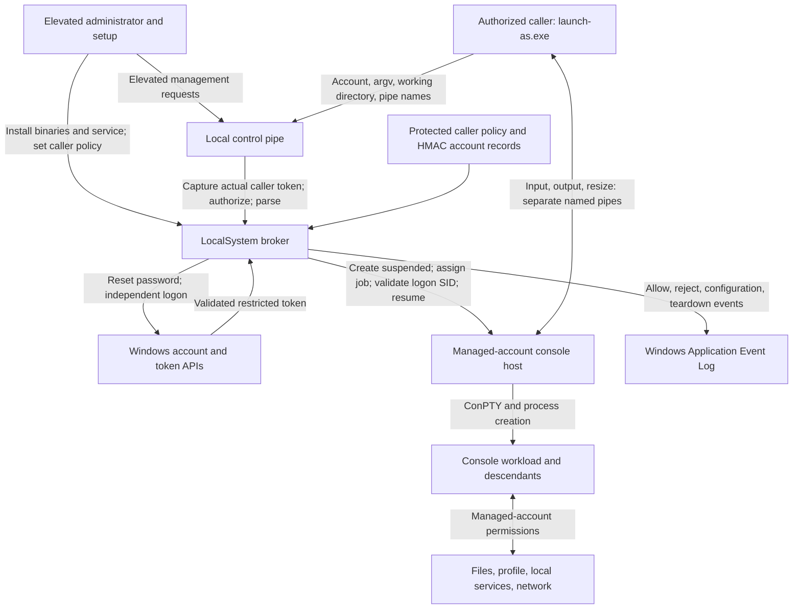

<!-- Project URL: https://github.com/fmuecke/launch-as -->

# Threat model and security assessment

Assessment date: 2026-09-15. Source baseline:
`45209b376a59c673592e80002202513c77917304`.

## 1. Assessment summary

`launch-as` reduces the damage a console workload can cause by running it under a managed local
account, with an independent logon session and reduced token privileges. A LocalSystem broker
owns password generation, logon, and process creation. The interactive client receives terminal
I/O and status, without receiving the account password or a reusable primary token.

The central security claim is conditional: the workload should not gain access to the caller's
processes through the caller's logon SID, or to the caller's interactive desktop through launcher
placement. Files, services, network endpoints, and other objects that already admit the managed
account remain accessible. A distinct logon SID does not override permissive object ACLs.

This is an alternate-account launcher with blast-radius controls. It provides no VM, container,
AppContainer, filesystem allow-list, network isolation, or isolation between workloads sharing
one managed account. The privileged broker is part of the trusted computing base: a broker
compromise can compromise the host.

**Assessment status:** source-based assessment, with deployment assumptions and open validation
items below. No build, test suite, installed-service acceptance, elevated probe, or exploit
reproduction was run for this document. Existing tests are evidence of intended coverage, not
fresh evidence that a deployed installation satisfies this model.

## 2. Scope and assumptions

### In scope

- `launch-as.exe`, `launch-as-admin.exe`, `launch-as-broker.exe`, and `launch-as-conhost.exe`.
- Installation and update through `Setup-LaunchAs.ps1` and the native installer.
- Local control and terminal pipes, request parsing, caller authorization, account management,
  password handling, token validation, profile loading, ConPTY, and job teardown.
- Protected installation files and `%ProgramData%\launch-as` configuration.
- A hostile console program, including its dependencies, scripts, descendants, and terminal output.

The [broker specification](launch-as-broker-spec.md) contains future design work as well as the
current contract. This assessment follows the source where they differ. GUI mode and proposed
profile-specific executable policies are not implemented controls.

### Required deployment assumptions

1. Windows, its kernel, account database, Service Control Manager, and privileged administrators
   are trusted. Administrator, SYSTEM, kernel, and offline disk attackers are outside the boundary.
2. Installation uses trusted package contents. The source directory cannot be modified by an
   untrusted principal during elevated installation. Installed files and their ancestors remain
   protected against replacement, ownership changes, and redirection.
3. Each managed account has only the groups, object permissions, and application credentials
   appropriate for its workload. An account used for unrelated privileged services or tasks is
   unsuitable even if it is not in Administrators.
4. The authorized caller account is trusted to select any managed account and arbitrary executable.
   Authorization identifies an account, not a particular signed client binary or a human gesture.
5. Filesystem ACLs, network policy, local service authorization, and secret provisioning are
   configured separately wherever workload access must be restricted.

## 3. Assets and adversaries

| Asset | Required protection |
| --- | --- |
| Host and LocalSystem broker | Untrusted requests and workloads must not obtain privileged execution or handles. |
| Caller processes, tokens, desktop, and private files | Avoid inherited caller identity and unintended access through UI, IPC, or object permissions. |
| Managed-account passwords and live tokens | Keep them inside the privileged logon path; do not expose them through supported client interfaces. |
| Caller policy, account SID records, ownership flags, and HMAC key | Prevent unauthorized changes that redirect launches or destructive account operations. |
| Installed executables and service configuration | Prevent unprivileged replacement or reconfiguration. |
| Workload state and terminal input/output | Keep unrelated accounts out; treat workload output and same-account peers as untrusted. |
| Session availability and cleanup | Bound admission and terminate processes associated with disconnected sessions. |
| Audit events | Record useful attribution without account passwords or sensitive command lines. |

Relevant adversaries are a malicious managed-account workload; another unprivileged local
account; a compromised authorized caller; and malicious files, packages, or remote responses
consumed by the workload. A compromised authorized caller already has the documented launch
authority, but must not gain account-management authority without elevation. Remote users are
not intended control-pipe clients; a network attacker can still influence network-connected
workloads.

## 4. Data flow and trust boundaries

The important boundaries are:

- **Installation to privileged execution:** administrator-selected files become service code.
- **Caller to broker:** requests cross from a normal process into LocalSystem. Pipe names,
  request IDs, account names, arguments, and paths are untrusted input.
- **Broker to managed account:** only the fixed installed console host is created by the broker;
  that host starts the requested executable under the managed account.
- **Workload to human terminal:** terminal bytes intentionally cross back into the caller's UI.
- **Managed account to host resources:** Windows object permissions and external policy determine
  access. The launcher does not add a workspace or network boundary.

## 5. Implemented controls and their limits

### Caller authorization and protocol

[BrokerServiceRuntime.cpp](src/BrokerServiceRuntime.cpp),
[BrokerPipeServer.cpp](src/BrokerPipeServer.cpp), and
[BrokerCallerPolicy.cpp](src/BrokerCallerPolicy.cpp) implement:

- A local message-mode control pipe with remote-client rejection and a protected DACL.
- SYSTEM/Administrators access plus the configured caller's explicit `0x0012008B` rights. These
  caller rights omit permission to create additional server instances. Windows aliases
  `FILE_APPEND_DATA` and `FILE_CREATE_PIPE_INSTANCE`, so generic write access requires care.
  See [Microsoft's named-pipe access rules](https://learn.microsoft.com/en-us/windows/win32/ipc/named-pipe-security-and-access-rights).
- First-instance creation for the initial broker pipe.
- Pipe-client impersonation to capture user SID, logon SID, session ID, and elevation; immediate
  reversion; and a cross-check against the connecting process's primary-token user SID.
  Failed reversion triggers process fail-fast.
- Exact caller-SID authorization for launch and management. Management changes additionally
  require elevation and confirmation; listing does not require elevation. Confirmation is a
  protocol intent flag, not an independent security boundary.

[BrokerProtocol.cpp](src/BrokerProtocol.cpp) uses a versioned, bounded parser: 64 KiB messages,
at most 64 arguments, validated identifiers and terminal pipe names, and rejection of unsupported
interactive mode. Request IDs correlate responses; they do not authenticate the server.

### Account ownership, secrets, and token creation

[BrokerRegistration.cpp](src/BrokerRegistration.cpp) requires a managed ownership record and
matches the current account SID before resetting its password or deleting it. Reusing a deleted
account's name does not automatically transfer ownership. Records in
[BrokerEnrollmentStore.cpp](src/BrokerEnrollmentStore.cpp) authenticate their header, SID, and
ownership flags with HMAC-SHA256; legacy records do not confer managed ownership. The key is a
local protected file, so HMAC does not protect against administrators or compromise of both the
store and key. It is not a rollback-prevention mechanism.

[BrokerDataDirectory.cpp](src/BrokerDataDirectory.cpp) creates protected directories admitting
SYSTEM, Administrators, and the service SID when available. Existing directories must have a
trusted owner and must not themselves be reparse points. These checks are stronger than simply
applying a new DACL to an attacker-owned directory.

[BrokerPassword.cpp](src/BrokerPassword.cpp) generates 32-character passwords using the Windows
cryptographic RNG and explicitly clears its password buffers. A launch serializes password reset,
`LogonUserW`, and process creation against other launches and management operations. The temporary
plaintext is cleared after the logon attempt. This does not erase Windows-owned authentication
state or invalidate already running sessions.

[BrokerLogonToken.cpp](src/BrokerLogonToken.cpp) validates the local account SID, rejects any
Administrators SID in the token, checks directly assigned privileges and minted-token privileges
against an allow-list, and applies `CreateRestrictedToken(DISABLE_MAX_PRIVILEGE)`. It requires
Medium integrity and no enabled privilege other than `SeChangeNotifyPrivilege` afterward.
No restricting SID list or general group-removal policy is supplied. Privilege reduction therefore
does not remove access granted by an account SID or retained group SID. See
[Microsoft's restricted-token API](https://learn.microsoft.com/en-us/windows/win32/api/securitybaseapi/nf-securitybaseapi-createrestrictedtoken).

### Process, desktop, and handle separation

[BrokerProcessLauncher.cpp](src/BrokerProcessLauncher.cpp) creates the fixed installed console
host with `CreateProcessAsUserW`, a target-user environment, and a loaded target profile. The
broker supplies no interactive desktop and performs no hop into the caller's session. Before
resume it assigns the host to a job and rejects a host logon SID equal to the captured caller SID
for that logon session. The runtime check compares extracted logon SIDs; the installed probe must
also verify absence of the caller's logon SID from the complete child `TokenGroups`.

The explicit inherited-handle list contains only NUL input and the exit-report/diagnostic pipe
writers. It does not contain a primary token or the broker control pipe. The deprivileged
[console host](src/PseudoConsoleHost.cpp) opens terminal pipes by name and starts the requested
executable without general handle inheritance.

The independent token removes the intended path through the caller's logon-SID default ACEs.
It does not prove denial against processes with permissive custom DACLs, account/group grants,
or other accessible IPC endpoints. Noninteractive placement must likewise be validated by actual
window-station and desktop access probes, not by a desktop name or an empty window list alone.

### Terminal and lifecycle

[TerminalBridge.cpp](src/TerminalBridge.cpp) creates random, first-instance, single-instance
terminal pipes restricted to SYSTEM, the caller, and the managed account. The host connects with
anonymous security quality of service, preventing the terminal server from obtaining its logon
identity through pipe impersonation. The control client uses identification-only quality of
service. These levels limit impersonation; they do not authenticate the opposite endpoint. See
[Microsoft's CreateFile security flags](https://learn.microsoft.com/en-us/windows/win32/api/fileapi/nf-fileapi-createfilew).

Each console session has a kill-on-close job. Control disconnect, service stop, and launch failure
drive job termination. The implementation admits four sessions globally, two per account, and
eight pipe workers, with bounded request I/O waits. These bounds limit broker admission, not
workload CPU, memory, disk, process count, network use, or repeated launch frequency.

Jobs cover associated processes. Work delegated to another service or mechanism outside the job
is not automatically contained; Microsoft explicitly documents exceptions to child association.
See [job-object behavior](https://learn.microsoft.com/en-us/windows/win32/procthread/job-objects).

## 6. Threat assessment

Priorities are qualitative remediation/validation priorities, not CVSS scores or claims of a
reproduced exploit. **High** means host privilege or major data exposure if the stated condition
holds; **Medium** means meaningful disclosure, interference, or availability loss; **Low** means
limited impact or an assurance gap. Accepted limits still require deployment decisions.

| ID | Threat and consequence | Controls and residual assessment |
| --- | --- | --- |
| T1 | Another account sends forged launch or elevated management requests. | Pipe ACL, actual-token identity, caller-SID comparison, elevation checks, and strict parsing address this boundary. Direct clients must be tested; CLI validation is insufficient. **High impact; controlled in source, live enforcement unverified.** |
| T2 | A local process impersonates the broker while its pipe is absent. | First-instance creation prevents the real service from joining an existing name; identification-only client access limits token misuse. The client does not authenticate the server before sending the request. **Medium; open gap G1.** |
| T3 | Malicious input exploits broker parsing, account operations, path handling, or Windows APIs. | Bounded protocol, local SID checks, privilege reduction, and fixed host path reduce exposure. Broker code still processes attacker-influenced data as SYSTEM. **High impact; residual trusted-code risk, with G3 requiring targeted validation.** |
| T4 | A workload reads caller memory or controls the interactive desktop. | Independent logon, suspended-host validation, and noninteractive placement address inherited identity/UI access. Explicit object grants and unrelated local-service weaknesses remain. **High impact; installed negative-access probes required.** |
| T5 | A workload reads/exfiltrates accessible files, attacks localhost services, or modifies a shared repository later executed by the caller. | The managed account's ACLs and external network/service policies govern access. No launcher allow-list prevents these actions. **High where sensitive resources are exposed; accepted scope limit.** |
| T6 | One session steals another session's data or interferes with its terminal. | Different accounts have different identities; same-account sessions share account permissions, profile, HKCU, and account-scoped terminal-pipe access. Fresh logon SIDs do not make them mutually distrustful tenants. **Medium or higher depending on shared secrets; accepted limit, G4.** |
| T7 | Malicious package contents, redirected install paths, or writable service files become SYSTEM code. | Elevated setup, quoted service path, protected install DACLs, and restricted service rights help after trusted installation. Artifact authenticity and pre-existing path trust need separate assurance. **High conditional impact; G2.** |
| T8 | Passwords or reusable tokens leak; account-name reuse redirects management. | Broker-owned generated passwords, buffer clearing, token checks, HMAC records, and SID matching address supported flows. Administrators, OS credential state, privileged dumps, and user-provided command-line secrets remain outside that promise. **High impact; controlled in source with deployment limits.** |
| T9 | A workload persists or exhausts resources; disconnect fails to drain all work. | Jobs, bounded admission, and disconnect teardown help. No resource quotas or general persistence cleanup exist; indirect service-created work may lie outside the job. **Medium; accepted availability limit plus G5.** |
| T10 | Terminal output spoofs a trusted prompt or triggers terminal-supported actions. | Output is intentionally relayed to the caller and is not a trusted UI. Account separation does not sanitize terminal control sequences or prevent social engineering. **Medium; accepted interaction risk.** |
| T11 | Account management or update fails halfway, or retirement leaves useful state behind. | Delete checks ownership and active sessions; record writes use a temporary file and replacement. Account changes and metadata changes are not one transaction. Forget does not revoke existing processes; uninstall retains accounts/configuration and profiles remain. **Medium; G5 and G6.** |
| T12 | Actions cannot be reconstructed from logs, or a local actor forges apparent attribution. | Event fields omit passwords and command lines, but writes are best-effort and early parse/identity failures bypass normal request auditing. Source labels alone are not tamper-proof actor identity. **Low to Medium; G7.** |

## 7. Open gaps and recommended work

### G1. Authenticate the broker endpoint — Medium

`OpenBrokerControlPipe` returns a handle immediately after opening the fixed name; it does not
verify the pipe server against the installed service. When the service is stopped, an attacker
who can create that name could receive executable arguments, working directory, and terminal pipe
names, spoof responses, or hold the client. No account password is sent, and identification-only
access blocks the original full-impersonation route.

Add server authentication tied to the expected service process and trusted identity before
transmitting requests. Validate races across service startup/restart and PID reuse. Reproduce the
stopped-service case with an unrelated standard account in a disposable test environment before
assigning exploitability beyond this source observation.

### G2. Make installation path and artifact trust explicit — High conditional impact

`CreateOrSecureBrokerInstallDirectory` applies a DACL to an existing install directory without
the owner/reparse rejection present in `CreateSecureDirectory` for ProgramData. File copying and
ACL application also use paths. A trusted, normally protected Program Files hierarchy is therefore
an important precondition; this observation alone does not establish an ordinary user's ability
to plant a hostile directory there.

Reject untrusted ownership and redirection at the install directory and destination files; inspect
ancestor permissions and test replacement races. Setup's SemVer downgrade guard is not artifact
authentication and is not a security boundary against an administrator using native installation.
The inspected installation path does not enforce a trusted signature or package hash. Define and
verify the package provenance policy before elevation.

### G3. Bound privileged filesystem resolution — Medium, validation needed

`ResolveBrokerWorkingDirectory` rejects literal network/device prefixes before filesystem access,
canonicalizes the path, and checks the result again. Canonicalization itself occurs as SYSTEM.
A local-looking path may contain a reparse point leading elsewhere, and path replacement can race
validation. The final prefix check does not prove that earlier resolution performed no network
access. This is a residual question, not a reproduced credential-disclosure finding.

Test local junction/symlink chains to UNC destinations and concurrent replacement while observing
network access. Consider resolving under an appropriately limited identity or using handle-based
validation that prevents unwanted redirection. Keep arbitrary executable selection an explicit
product decision; it is not an allow-list bypass.

### G4. Keep account-scoped terminal access out of tenant-isolation claims — Medium

Terminal ACLs grant the managed account read/write access. Connection completion does not bind
the peer to the newly launched host process or logon session. Random names and a single server
instance reduce accidental collision, but do not authenticate a same-account peer that discovers
a name and races the host. Generic write rights also merit review under named-pipe access rules.

Use separate managed accounts for mutually untrusted workloads. If per-session confidentiality
becomes a requirement, design authenticated session binding and narrower pipe rights, with race
tests. Do not infer that an additional pipe instance is currently exploitable despite the
single-instance limit.

### G5. Complete profile and draining semantics — Medium

Each `BrokerChildProcess` independently loads/unloads its profile; there is no account-scoped
profile lease. `Reset` ignores profile-unload errors. `FinishProfileSession` releases admission
even when process-tree termination was not confirmed, while emitting an error event. Kill-on-close
still applies, but a released slot is not proof that every prior process has exited.

Validate overlapping sessions, retained registry handles, teardown timeout/query failures, and
cross-account operations. Define explicit draining behavior and shared-profile lifetime. Delete
blocks counted active sessions; takeover and forget do not implement equivalent account draining.
Document forget as removal of management metadata, not immediate revocation of existing activity.

### G6. Define recovery and retirement — Medium

Account creation/password reset can succeed before writing ownership metadata fails. Account
deletion can succeed before metadata removal fails. Installation can stop the service and replace
some files before a later operation fails. The store's temporary-file replacement does not make
these multi-object operations transactional.

Add failure-injection coverage and a documented recovery procedure. Define operator verification
of the actual account SID, ownership record, installed file set, and service state after failure.
Retirement must separately address retained accounts, profile secrets, user-created persistence,
and external credentials; uninstall alone is not secure erasure.

### G7. Treat audit as best-effort telemetry — Low to Medium

`AuditRequest` ignores event-write failures, and malformed requests or failed identity capture can
return before it is called. Request IDs are caller-supplied. Event-source names do not establish
cryptographic provenance, and local administrators remain able to alter audit evidence.

If complete security auditing is required, record bounded early-rejection events, expose logging
failure health, and test forwarding/retention. Preserve the current exclusion of passwords,
tokens, full arguments, and environment contents.

## 8. Validation plan

All checks below are **pending for this assessment**. Use disposable accounts and an isolated
installation for destructive, elevated, network-redirection, and failure-injection probes.

| Boundary | Existing coverage to inspect/run | Additional acceptance evidence required |
| --- | --- | --- |
| Protocol and caller authorization | `BrokerProtocolTests`, `BrokerPipeTests`, `BrokerCallerPolicyTests`, `BrokerCommandTests` | Unrelated-account and managed-account direct clients denied; spoofed identities rejected; management denied without actual elevation; stopped-service fake-server test. |
| Account, password, and token | `BrokerPasswordTests`, `BrokerEnrollmentStoreTests`, `BrokerAccountProvisioningTests` | SID replacement, record/key tampering, direct powerful privilege and privileged-group cases; secret absence from IPC/logs; inspect complete minted token. |
| Installation and storage | `BrokerDataDirectoryTests`, `BrokerServiceInstallerTests`, setup contract tests | Actual file/directory owners and ACLs, service change rights, policy/key read/write denial, reparse/ownership cases, partial update recovery. |
| Process and UI separation | `BrokerProcessLauncherTests`, `BrokerChildIdentityProbeTests`; `Invoke-BrokerProbeAcceptanceTest.ps1` | Distinct logon SID, caller's logon SID absent from child `TokenGroups`, denied `PROCESS_VM_READ`/`PROCESS_TERMINATE` against controlled caller targets; probe interactive desktop/window-station access and private-file canaries. |
| Terminal and disconnect | `BrokerTerminalBridgeTests`, `TerminalDisconnectTests`; `Invoke-BrokerConsoleAcceptanceTest.ps1` | Installed exit-code/resize behavior, abrupt client death, service stop, descendants, inherited-handle audit, terminal connection races. |
| Concurrency and profile lifetime | `Invoke-BrokerSameAccountConcurrencyTest.ps1` | Two-account overlap, fifth global launch rejection, independent teardown, held profile handles, unconfirmed termination, management during draining. |
| Host-resource exposure | Deployment-specific probes | Managed-account filesystem and local-service access, outbound/loopback connectivity, same-account interference, indirect process creation, persistence and resource exhaustion. |
| Audit | `BrokerAuditTests` | Real event fields, malformed/unauthorized traffic, unavailable Event Log, forwarding and retention behavior. |

Build/test entry points are documented in [README.md](README.md). Use `build.ps1 -RunTests` for
host-safe CTest coverage and `-RunSandboxTests` for the privileged subset. `-RunAllTests` runs both
and offers the separate interactive acceptance workflow in a fresh Windows Sandbox. The workflow
automatically creates an authorized caller, removes its temporary administrator membership, and
uses a fresh non-elevated logon with a real visible console. A SYSTEM run, parser pass, elevated
Sandbox token, or redirected-stdin launch does not substitute for that environment.

## 9. Security invariants for future changes

- Authenticate actual callers and enforce management elevation in the broker, even for direct IPC.
- Keep account passwords and reusable primary tokens out of client IPC, arguments, environment,
  diagnostics, and audit records.
- Preserve SID-pinned ownership, non-administrative token validation, privilege reduction, and
  independent logon creation. Recheck group-based permissions when changing account eligibility.
- Create only trusted broker helper code with the privileged launch path; keep arbitrary workload
  execution under the managed identity with an explicit inherited-handle set.
- Assign the job and validate identity before resuming untrusted execution. Preserve disconnect
  cleanup and report uncertainty when complete teardown cannot be established.
- Treat terminal output, shared writable files, and same-account peers as untrusted.
- Reassess this model after changes to IPC, install paths, account ownership, token creation,
  inherited handles, profiles, networking, or session lifetime.
- Any future GUI mode requires a separate assessment of authenticated session selection,
  window-station/desktop ACLs, RDP/session switching, and cleanup. Console evidence does not
  establish shared-desktop safety.
